<p align="center">
  
  
  <a href="https://discord.gg/YOUR_REAL_INVITE_CODE"></a>
  <a href="https://mc.hypeland.org"></a>
</p>

<p align="center">
  
</p>

<h1 align="center">BedWars</h1>

<p align="center"><strong>The last BedWars plugin you will ever need to purchase.</strong></p>

**Production-grade BedWars for Minecraft 1.8.8 (Spigot / Paper).**
BedWars is a complete, self-contained game plugin written from scratch by a single developer — **not a fork, not a custom edit of any existing project**. One purchase unlocks **everything**: the full game core, all 36+ built-in add-ons, the entire 257-cosmetic suite, the replay system and ranked access. There is no add-on store, no paid extras, and no feature behind a second payment — the single price already covers 100% of the plugin, forever.

---

## Table of Contents

- [Test Server – Try Before You Buy](#test-server--try-before-you-buy)
- [Why BedWars?](#why-bedwars)
- [Inside the Game — Every Menu](#inside-the-game--every-menu)
- [Arena Setup Mode — Holograms Included](#arena-setup-mode--holograms-included)
- [Core Features – Expanded](#core-features--expanded)
- [Competitive Comparison](#competitive-comparison)
- [Why Exclusively 1.8.8?](#why-exclusively-188)
- [Performance That Holds](#performance-that-holds)
- [Reliability & Fair Play](#reliability--fair-play)
- [Ranked System (Full)](#ranked-system-full)
- [Private Games](#private-games)
- [Practice Arenas](#practice-arenas)
- [Replay System](#replay-system)
- [Cosmetics — 257 and Counting](#cosmetics--257-and-counting)
- [36+ Built-in Add-ons — All Included](#36-built-in-add-ons--all-included)
- [Commands & Permissions](#commands--permissions)
- [Full Configuration — With Ready Defaults](#full-configuration--with-ready-defaults)
- [Automatic Database Backup](#automatic-database-backup)
- [Database & Storage](#database--storage)
- [PlaceholderAPI — Complete Reference](#placeholderapi--complete-reference)
- [Optional Integrations](#optional-integrations)
- [BungeeCord, Proxy Plugin & Auto-Scale](#bungeecord-proxy-plugin--auto-scale)
- [Developer API](#developer-api)
- [The Official Repository](#the-official-repository)
- [Frequently Asked Questions](#frequently-asked-questions)
- [Support & Purchasing](#support--purchasing)
- [Roadmap](#roadmap)

---

## Test Server – Try Before You Buy

A live, fully functional demo network is available so you can evaluate BedWars before making any commitment.

```
IP: mc.hypeland.org
```

The test server runs the latest stable build with every add-on enabled. You can experience ranked matchmaking, the full shop, generators, team upgrades, replays, cosmetics, quests and every other system exactly as your players would. **No registration, no whitelist — connect and play immediately.** The shop you play on the demo is the same default shop that ships inside the download, which is exactly the point: the plugin arrives already playable, and the demo simply proves it. If a feature you care about is not visible on the demo, ask about it in DMs and you will be shown where to test it.

**Demo server offline?** If the test server happens to be down, just open a DM with the developer and request a test loader for the plugin. You will receive a **1-day test loader** that grants access to the **beta build of BedWars — not the release version** — so you can still evaluate the plugin directly on your own server before buying.

---

## Why BedWars?

BedWars is not a collection of loosely connected plugins held together by third-party dependencies. It is one complete solution built from the ground up for networks that cannot afford downtime, lag, or incomplete gameplay. Every mechanic below ships inside the single download — and every one of them is included in the single price.

### One Reason to Exist — Quality
BedWars was not written to fill a marketplace slot, and it is not engineered down to a price. **The only reason this plugin exists is Nerotek01's pursuit of quality in everything** — the refusal to ship a menu that could open cleaner, a generator that could tick smoother, or a setup flow that could guide better. That single standard is why the game core, all 36+ add-ons, the cosmetics suite, replays and ranked live in one original codebase instead of being stitched together from half-solutions, and why every screenshot in this README is a real capture rather than a mockup. Quality here is not a feature checked off a list; it is the reason the plugin was built at all — and it is the thing your players will feel within their first minute on the server.

### The Only Plugin That Truly Unifies Everything
Every feature you need — deposit chests, generator splitting, a full competitive ranked system, a complete cosmetics suite, match replays, private games, dedicated practice arenas, quests and anti-AFK management — lives inside **one plugin**. You never install extra add-ons, you never pay for separate modules, and you are never left debugging version conflicts between half a dozen plugins. BedWars ships with **36+ built-in add-ons** that share the same configuration system and the same player data. When you enable an add-on it works instantly; when you disable it, it consumes nothing. **And because every add-on is part of the plugin itself, your single payment already covers all of them — there is no add-on store and nothing to unlock later with more money.**

### Original Code — Not a Fork, Not a Reskin
BedWars is written from scratch, line by line, by the developer you talk to. It is **not a fork** of any open-source BedWars project, **not a custom edit** of another premium plugin, and **not a rebrand** of someone else's work. That matters to you as a buyer in three very practical ways. First, every feature behaves the way it was designed to behave — there is no inherited legacy code fighting the new systems. Second, bugs are fixed at the root, because the person fixing them understands every line they touch. Third, you get honest answers about what the plugin can and cannot do, because there is no upstream project to hide behind.

### Built for Networks, Not Just Single Servers
BedWars was designed for large, multi-server deployments from day one. It includes its own **BedWarsProxy** companion plugin that runs on BungeeCord or Velocity — included in the same purchase, with no separate fee. The proxy handles lobby connections, global queues, matchmaking and automatic server scaling without external scripts. Whether you run one lobby or fifty game servers, every player gets the same fast, consistent experience, and every game server keeps a solid **20 TPS** because the game loop is protected by design.

### Extreme Performance, Not an Afterthought
Performance is treated as a first-class feature. Generators are processed on a smart schedule instead of being checked every tick. All database work happens in the background, so the game never stutters for a save. Map resets finish in milliseconds. Menus open instantly — even the cosmetics menu, with its hundreds of items. The scoreboard only updates when something actually changes. The result is a plugin that stays at **20 TPS under full load** — not just in benchmarks, but in real, peak-hour traffic.

### True Competitive Play with Native Ranked
Unlike alternatives that bolt on a third-party ELO plugin, BedWars includes a full ranked system natively. It connects to a central ranked service, manages automated matchmaking, tracks ELO ratings across seasons, supports tournament NPCs, and exposes a complete set of placeholders for lobby displays. This is not a simplified add-on — it is a complete competitive infrastructure, and like everything else it is included in the base price.

### Zero Recurring Costs, Truly Unlimited License
One payment of **€29.00** grants a permanent license that covers **all servers you own** — whether you run a single lobby or a 50-server network. There are no monthly fees, no per-server charges, **no paid add-ons at any point**, and no hidden costs. All updates for the current major version are included free. The price you see is the last euro you will ever spend on this plugin.

### Direct Access to the Developer
When your server has an issue at peak time, you do not file a ticket and wait. You speak directly to the person who built the plugin. Support is available **24/7** through Discord or Bale, and every report is handled with the urgency a live network demands.

---

## Inside the Game — Every Menu

The fastest way to judge a BedWars plugin is to look at its menus. What follows are **twelve real, unedited in-game menus** captured from a live server — exactly what your players will see on day one. Note how much is already configured: every menu below opens and works immediately after installation, because all of the important parts ship with complete default configurations.

### Cosmetics — the customization hub

<p align="center">
  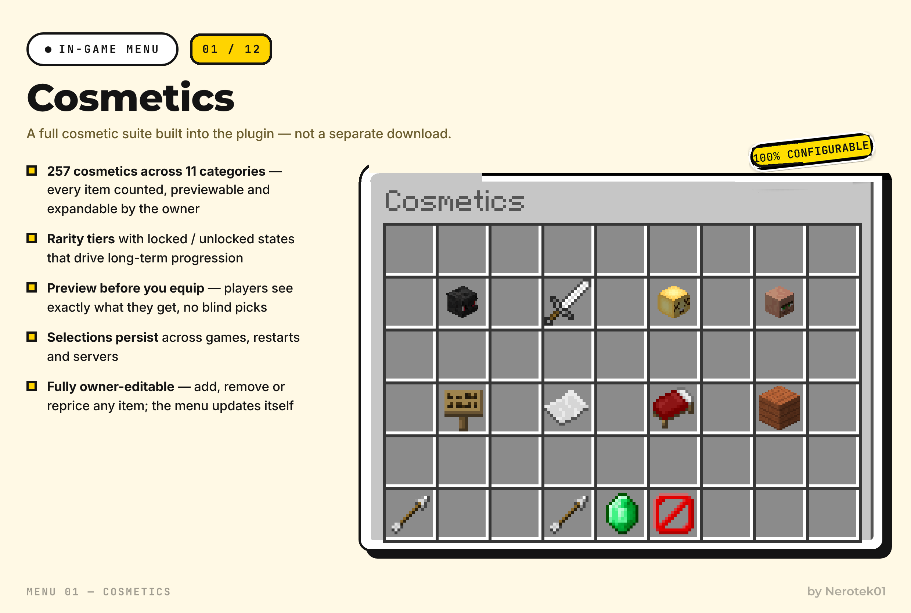
</p>

The cosmetics menu is the heart of player customization. It organizes **257 cosmetics across 11 categories** (the complete count is listed [below](#cosmetics--257-and-counting)), each with rarity tiers, locked and unlocked states, and a live preview so players never equip blind. The bottom row of the menu holds the navigation items players actually use daily — quick equips, the emerald hub shortcut and the close action — exactly where muscle memory expects them. Every selection is saved to the player's profile and follows them across games, restarts and servers. Because the suite is built in, there is nothing extra to install, no extra database, and no compatibility risk — cosmetics simply work, and they scale with your economy instead of fighting it.

### Shop — the default in-game shop

<p align="center">
  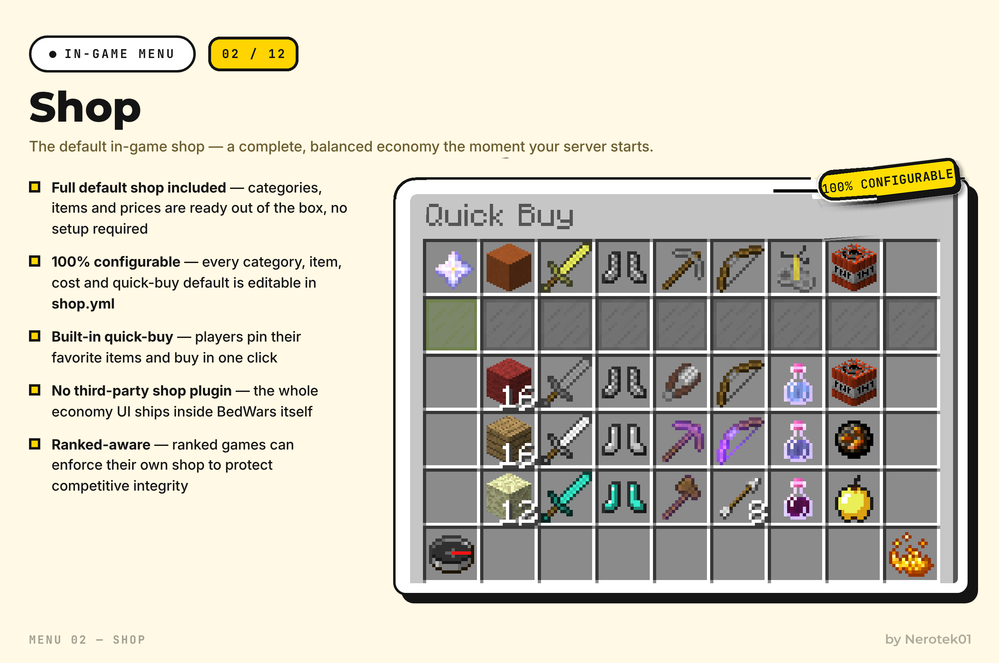
</p>

The shop is where every BedWars economy lives or dies, and BedWars ships with a **complete default shop already configured** — categories, items, prices and the quick-buy layout all work the moment your server starts, exactly as the real screenshot shows. The layout is the structure players already know from big networks: pinned quick-buy slots on top, then blocks, melee, armor, ranged, potions and special items, each in its own clearly separated row. And it is all **100% configurable**: every category, every item, every price and every quick-buy default lives in `shop.yml`, so you can reskin the entire economy without touching a single line of code. Because the shop is part of the plugin itself, there is no third-party shop plugin to maintain, no version mismatches and no integration gaps — and ranked games can even enforce their own shop to protect competitive integrity.

### Edit Quick Buy — a shop shaped by each player

<p align="center">
  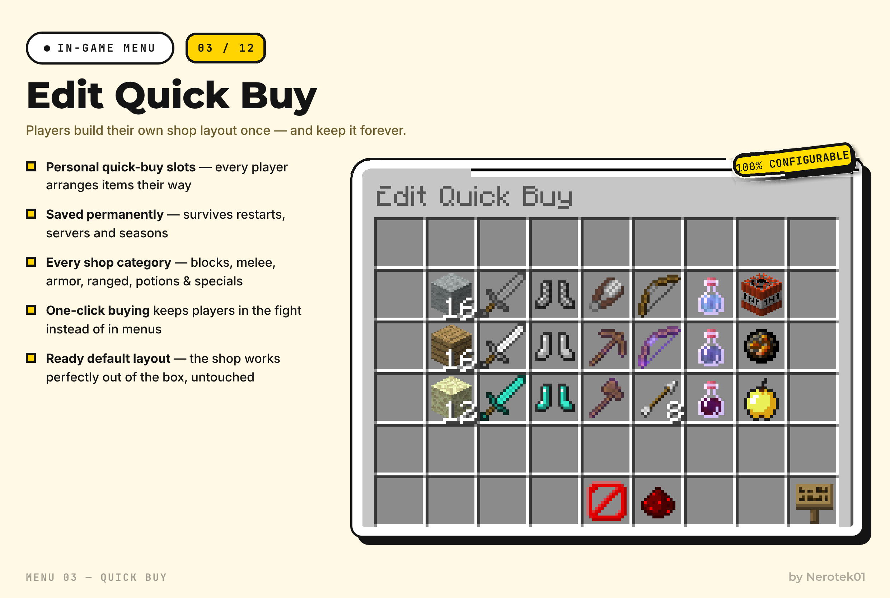
</p>

Every player can arrange their own quick-buy slots from any shop category — blocks, melee, armor, ranged, potions and special items — and that layout is saved permanently. In the next match, the shop behaves exactly the way each player expects: their essential items are one click away, every single game. The screenshot shows the default layout a fresh player receives — sensible, balanced and immediately usable — while the bottom row holds the special-item slots and the save action. This is one of those quality-of-life details players notice on the first day and refuse to play without afterwards.

### Team Upgrades — the team tech tree

<p align="center">
  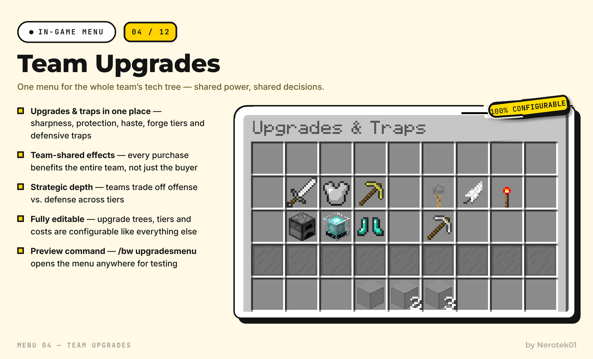
</p>

The upgrades menu is the team's shared tech tree. In one place, players spend team resources on shared power — **sharpness, protection, haste, forge tiers and defensive traps** — and every purchase benefits the entire team, not just the buyer. That shared-decision moment is where the memorable negotiations of BedWars team play come from: commit to defense or rush offense? The real screenshot shows the **"Upgrades & Traps"** menu exactly as your players will see it, with every upgrade slot in its place. Like everything else in the plugin, the upgrade trees, tiers and costs are fully editable — and staff can open the menu anywhere with `/bw upgradesmenu` for testing and demonstrations.

### Map Selector — every game, one menu

<p align="center">
  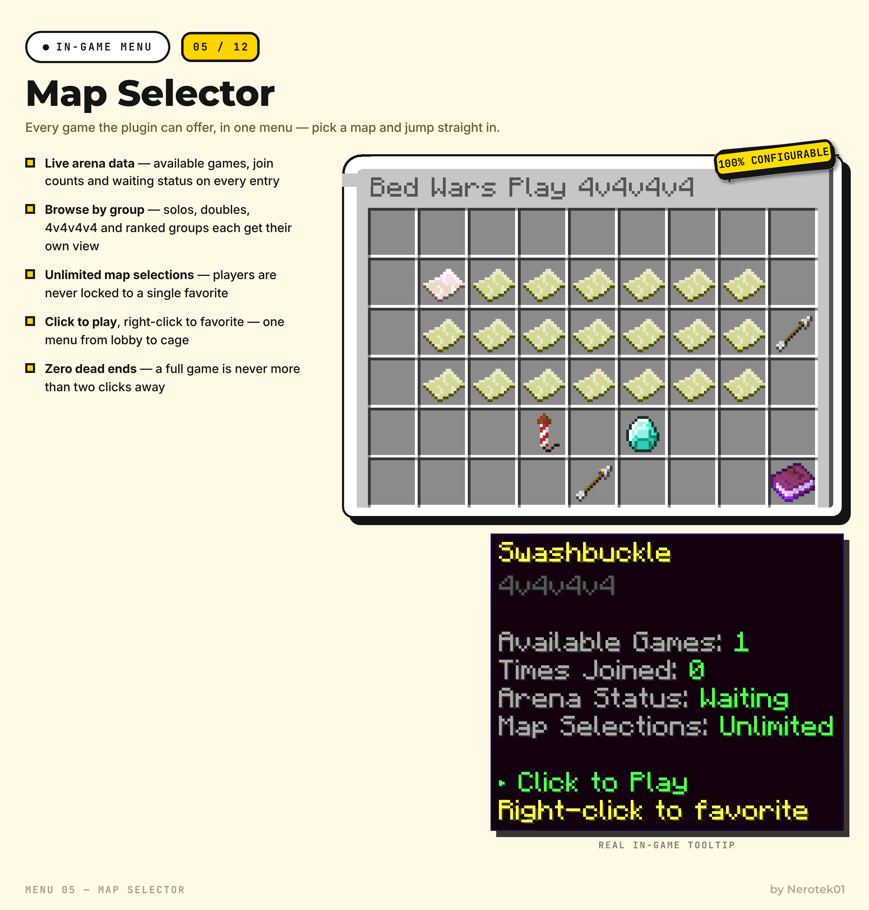
</p>

The map selector turns "finding a game" into two clicks. Every entry is a real map backed by **live arena data** — the genuine tooltip in the screenshot shows exactly what a player sees before joining: available games, times joined, arena status and map selections. A left click joins that game instantly; a right click favorites the map for later. Map selections are **unlimited**, so players are never locked out of variety, and each game group — solos, doubles, 4v4v4v4, ranked — gets its own browsable view. For your community this means maps actually get played: every arena you configure becomes visible, joinable and favorite-able from one menu.

### Team Selector — pick your side

<p align="center">
  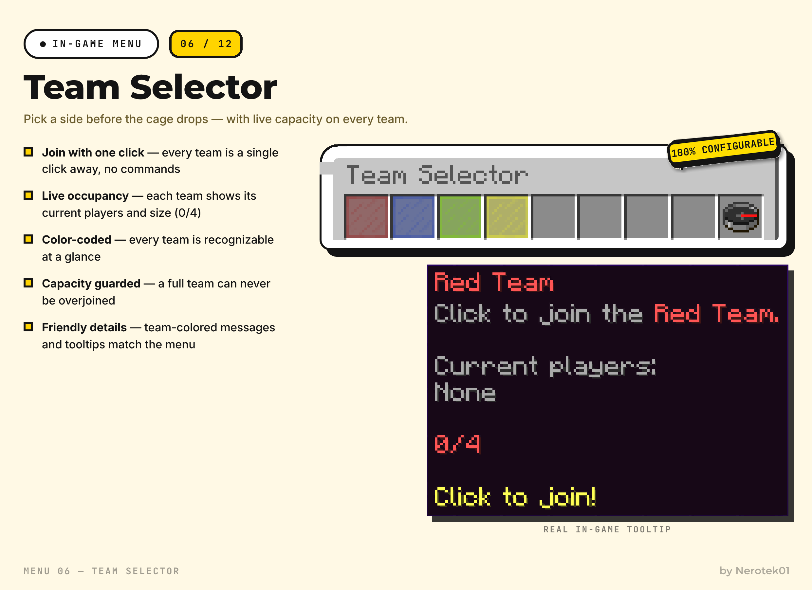
</p>

Before the cages drop, the team selector lets players choose their side with a single click — no commands to remember. Every team is presented in its color at a glance, and the tooltip tells the live truth: the team name, a colored "click to join" call to action, the **current players on the team** and its exact **capacity (0/4)**. Capacity is strictly enforced — a full team can never be overjoined, which removes an entire class of lobby arguments before they can start. The menu stays open, so players can coordinate, switch and settle teams in seconds while the lobby fills.

### Play Bed Wars — the join hub

<p align="center">
  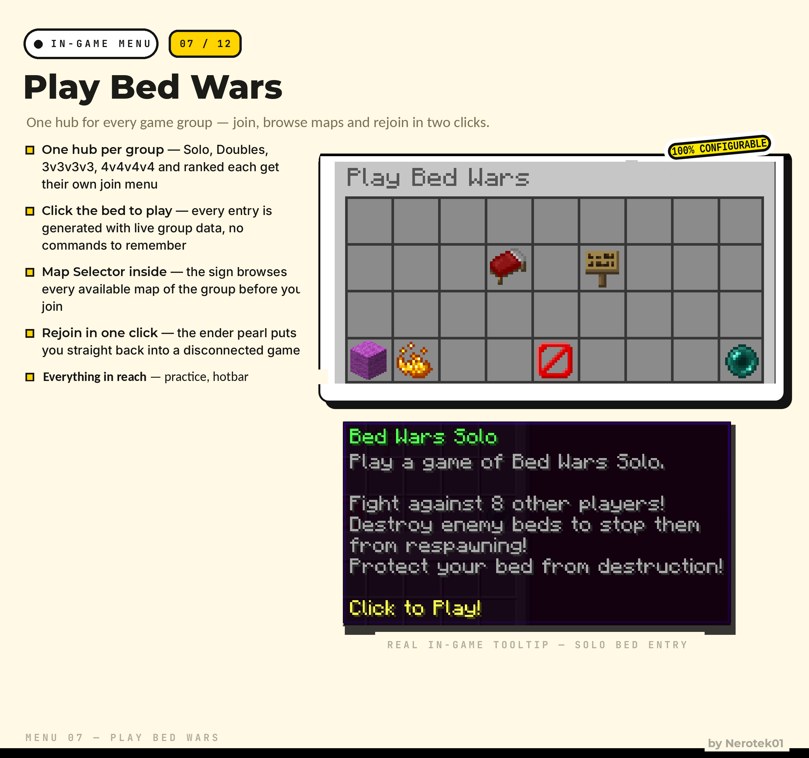
</p>

The join hub is the front door of the whole plugin (`/bw gui`). One clean menu per game group — the bed item is generated for the group you are browsing, and its tooltip carries the real group data: **"Bed Wars Solo — Fight against 8 other players!"** with the honest warning that enemy beds must be destroyed to stop respawns. One left-click on the bed joins that group's queue instantly. The sign next to it opens the group's **Map Selector** without breaking the flow, the ender pearl is a one-click **rejoin** for disconnected players, the wool block jumps straight into **Practice**, and the blaze powder opens the **Hotbar Manager**. Every entry in this menu is defined in a simple config file — names, lore, slots, sounds and commands — so the hub can be reshaped for a network without touching a single line of code.

### Statistics — every number, in game

<p align="center">
  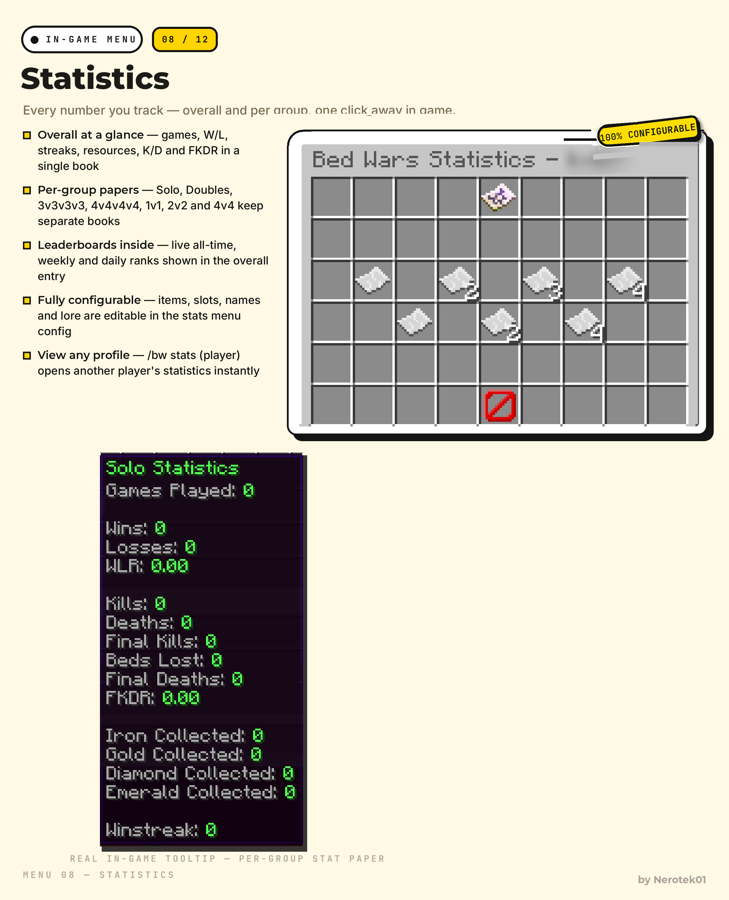
</p>

The statistics menu (`/bw stats`) turns the plugin's full stat tracking into a clean in-game bookshelf. The enchanted map at the top holds the **Overall Statistics** book — games played, wins, losses, WLR, best and current winstreak, every resource collected, kills, deaths, final kills, final deaths, FKDR — plus the live **Core Mode Leaderboards** (all-time, weekly and daily ranks) directly inside the tooltip. Each paper below is a **per-group book**: Solo, Doubles, 3v3v3v3, 4v4v4v4, 1v1, 2v2 and 4v4, with the stack size matching the team size. Every value is placeholder-driven, so the numbers are always live, and the whole menu is config-driven — items, slots, names and lore are owner-editable. `/bw stats (player)` opens any player's profile in the same layout.

### Replays — every match, recorded

<p align="center">
  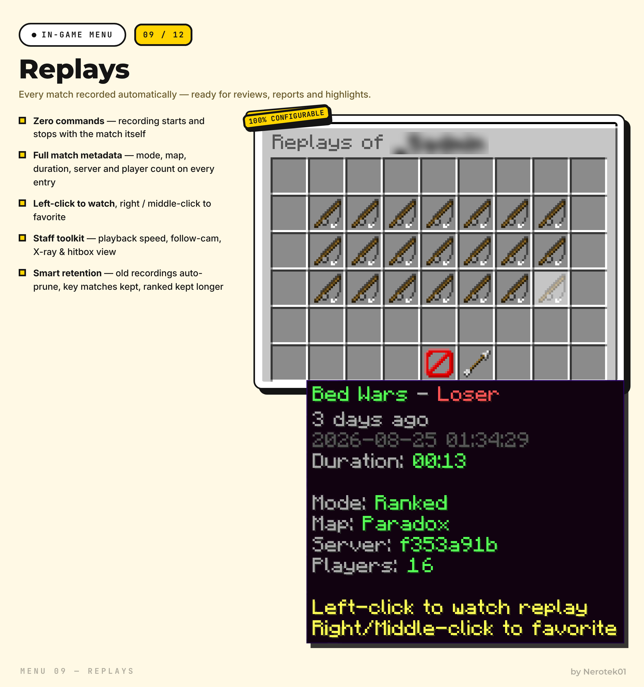
</p>

The replays menu lists every recorded match with its full metadata — game mode, map, duration, server and player count — visible at a glance in the hover tooltip before watching. In the screenshot you can see a real ranked entry: mode, map, the server instance it ran on, and the players in the recording. One left-click plays the replay; a right-click favorites it so important evidence never gets auto-deleted. Staff gain a complete review toolkit: adjustable playback speed, follow-cam, X-ray view for invisible players and hitbox visualization for reach checks. For competitive integrity, ranked matches are recorded and retained longer automatically.

### Quests — progression that retains players

<p align="center">
  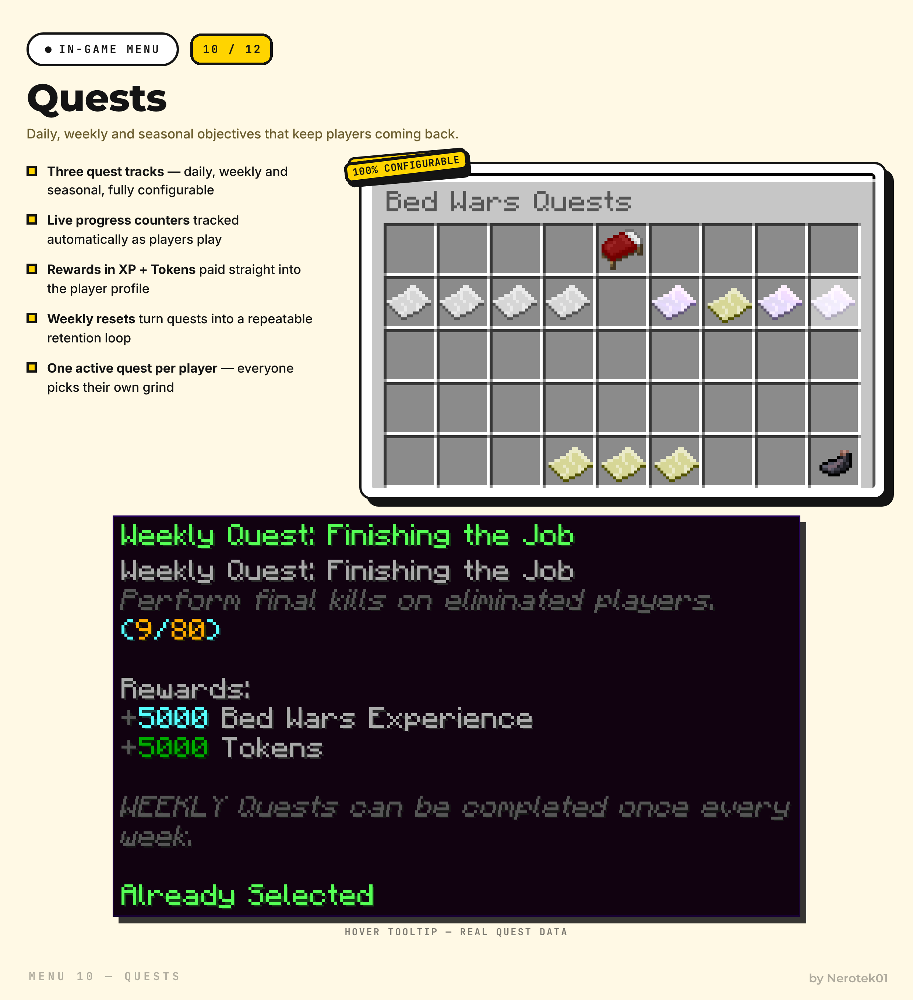
</p>

The quests menu runs three tracks — daily, weekly and seasonal — with live progress counters tracked automatically as players play. The tooltip shows a real weekly quest with its live counter, its exact rewards (+5,000 Bed Wars experience, +5,000 tokens) and its reset rule, so players always know what a quest pays before committing. Rewards are paid straight into the player profile as experience and tokens, feeding the level system and the cosmetics economy at the same time. Weekly quests reset every week, which turns quest rewards into a repeatable reason for your players to come back — the cheapest retention system a network can run.

### Practice — the training ground

<p align="center">
  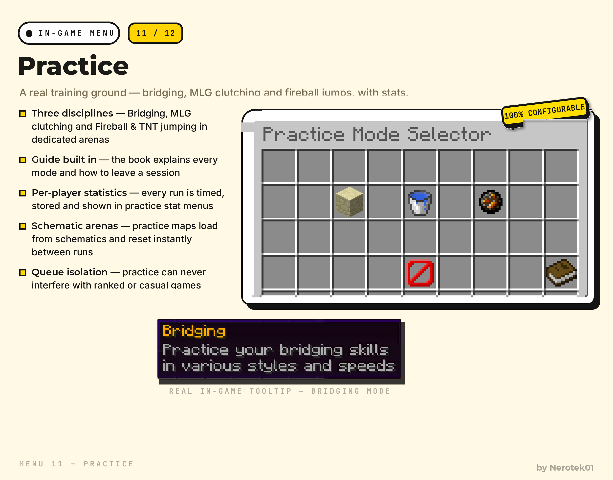
</p>

The Practice Mode Selector (`/bw practice`) is a real training ground, not a lobby gimmick. Three disciplines sit in the first row: **Bridging** (sandstone — "practice your bridging skills in various styles and speeds"), **MLG clutching** (water bucket — different heights and positions) and **Fireball & TNT jumping** (fire charge — directional jump training). The book in the corner is the **Practice Guide**: it explains every available mode and how to leave a session at any time. Every run is timed and stored per player, dedicated practice stat menus show the progress, maps load from schematics and reset instantly between runs, and other players can spectate sessions live. Strict queue isolation keeps practice, ranked and casual play from ever interfering with each other.

### Hotbar Manager — muscle memory, respected

<p align="center">
  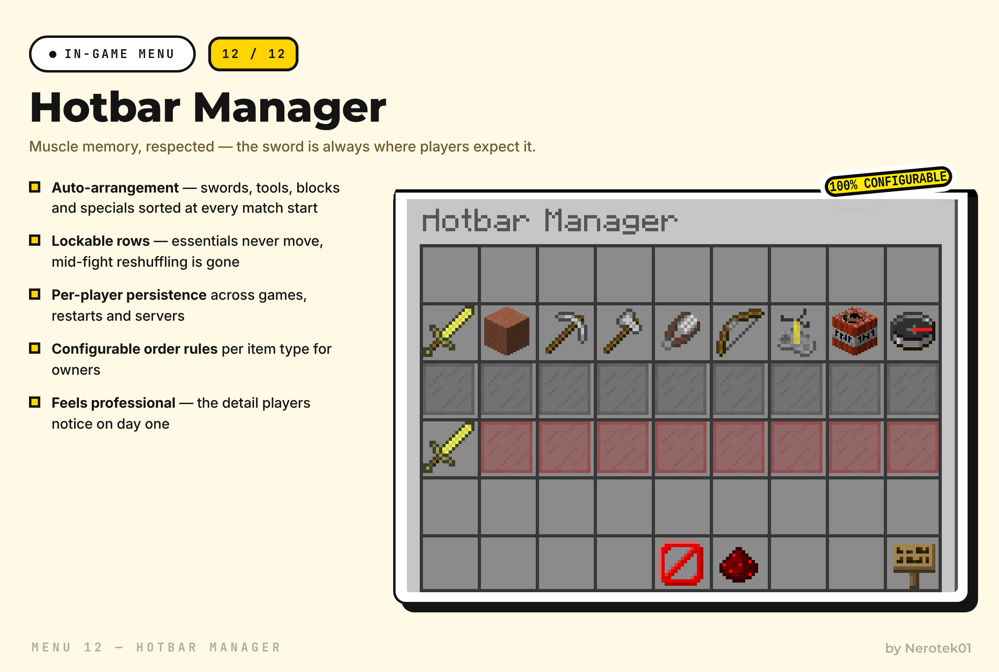
</p>

The hotbar manager automatically arranges swords, tools, blocks and special items into a consistent order at the start of every match, and players can lock rows so their essentials never move — the locked row is highlighted directly in the menu. Combined with per-player persistence, it means zero mid-fight hotbar reshuffling: the sword is always where the player expects it to be. Small feature, enormous difference in how "professional" the game feels.

## Arena Setup Mode — Holograms Included

BedWars is not only polished for players — the admin experience gets exactly the same treatment. **Arena Setup Mode** turns building a ranked-grade arena from a config-file chore into a guided, in-game walkthrough: you pick a setup method, and the plugin builds with you — checks flip from `NOT FIXED` to `FIXED`, a live progress percent climbs, and holograms float through the world narrating the next step. Everything captured below comes from a real session on a real arena.

### One Menu, Three Setup Methods

<p align="center">
  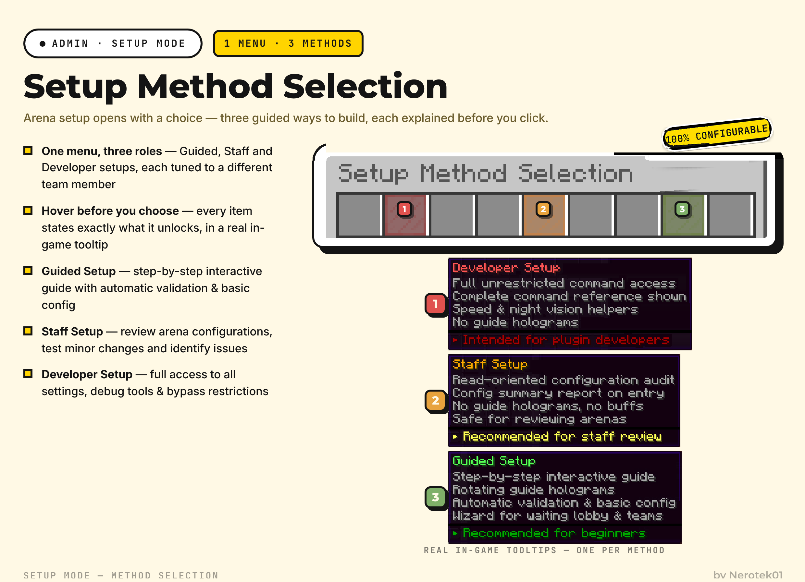
</p>

Setup opens with a single choice, and the menu makes sure you choose correctly. **Guided Setup** is the beginner's path — a step-by-step interactive guide with rotating guide holograms, automatic validation and a sane basic config, plus a wizard for the waiting lobby and teams written for you as you go. **Staff Setup** is built for review work: a read-oriented configuration audit with a config summary report on entry, no guide holograms and no buffs — safe for reviewing arenas without ever holding full production power. **Developer Setup** removes every leash — full unrestricted command access with the complete command reference shown, speed and night vision helpers, no guide holograms — and is explicitly labeled as intended for plugin developers. All three items state their access level in a **real hover tooltip before you click** (each one is captured in the card above), so nobody has to guess what a mode will unlock. One menu, every role covered — from a first-time builder to the plugin developer himself.

Each mode also carries its **own limited command set**: blocked commands are denied with a clear message instead of failing silently, and `/bw setup` lists only the commands available in the active mode. Guided covers the wizard essentials (teams, spawns, beds, shop and upgrade NPCs, generators, `settype`, `save` plus guided-only `autocreateteams`), Staff is read-only with just `save`, and Developer keeps the complete classic reference — including `setspectspawn`, `setkilldrops`, `setmaxinteam`, `setmaxbuildheight` and direct generator-tier arguments.

### Holograms That Build With You

<p align="center">
  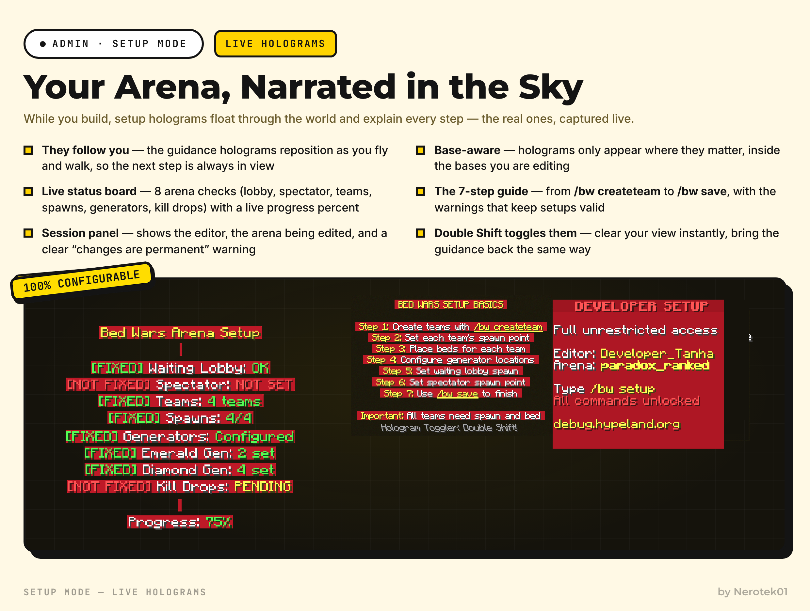
</p>

While setup mode is active, three kinds of holograms accompany you through the world, and each one has a precise job:

**The status board** — a live checklist of everything a valid arena needs: Waiting Lobby, Spectator spawn, Teams, Spawns, Generators, Emerald Gen, Diamond Gen and Kill Drops. Every line is real state, not decoration: unfinished items show as struck-through red `[NOT FIXED]` entries and flip to green `[FIXED]` the moment you complete them — in the capture above, six checks are already green while Spectator spawn and Kill Drops are still pending. Underneath, the overall **Progress percent** (75% in the capture) updates as you work, so you always know exactly how far the arena is from `/bw save`.

**The step guide** — keeps the whole route in front of you: the seven steps from `/bw createteam`, through setting each team's spawn point, placing every team's bed, configuring generator locations, setting the waiting-lobby spawn and the spectator spawn point, to the final `/bw save`. It also carries the two reminders that save the most headaches: **all teams need a spawn and a bed**, and **Double Shift toggles the holograms** whenever you want a completely clear view of your build.

**The session panel** — sits beside you for the entire session and always tells the truth, and it adapts to the mode you picked: in Developer Setup it reads **DEVELOPER SETUP — full unrestricted access**, shows who is editing (`Editor: Developer_Tanha`), **which arena is open** (`Arena: paradox_ranked`), how to begin (`Type /bw setup`), the confirmation that **all commands are unlocked**, and the server identity (`debug.hypeland.org`) so every capture is traceable.

And the behavior ties it all together: **the holograms follow you** — they reposition as you move through the arena, so the next instruction is always in view instead of being left back at spawn — and they are **only displayed where they matter, inside the bases** you are wiring up: walk into a team base and its relevant guidance is there, not a wall of unrelated text. Arena setup stops being documentation-versus-reality debugging and becomes a conversation with the arena itself.

---

## Core Features – Expanded

<p align="center">
  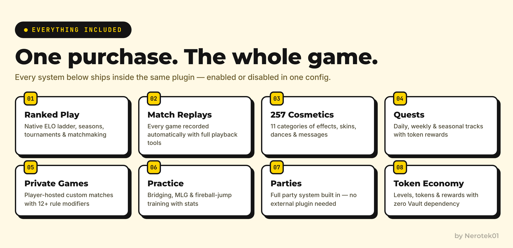
</p>

### Complete BedWars Mechanics
Every core mechanic is implemented in full: destructible beds, resource generators with configurable timers and tiers, team-shared upgrades (sharpness, protection, haste, heal pool, base traps, dragon buffs and more), a fully customisable item shop, and special items such as fireballs, dream defenders, bed bugs, pop-up towers and bridge eggs. Scheduled match events — diamond and emerald generator tier-ups, the bed destruction countdown, and the ender dragon sudden-death phase — are all configurable through simple files with no hidden hard-coded behavior. None of these mechanics are "premium extras": the full game logic is part of the one download and the one price.

### Flexible Game Modes
Each arena can be configured for Solo, Doubles, Triples or Quads. Mode-specific behavior — team sizes, shop content, generator rates — is handled automatically, and multiple arenas can run different modes simultaneously on the same server. Switching an arena's mode is a single command, so you can react to what your players actually queue for instead of what you guessed last month.

### Server Modes for Any Network Topology
- **Multi-Arena** – several arenas on one server, managed by an internal queue.
- **BungeeCord** – one arena per server, connected to the lobby through the dedicated BedWarsProxy plugin.
- **Auto-Scale** – the proxy signals your infrastructure to start or stop game servers based on player demand, with zero manual work.
- **Shared** – a single arena instance shared across multiple servers (advanced setups).

Each topology is a config value, not a different download. You buy once and can migrate between setups as your network grows.

### Spectator System
After elimination, players enter spectator mode with fly speed controls, night vision toggle and auto-teleport to active players. A dedicated **Teleporter GUI** lets spectators jump between alive players instantly — including a one-click random teleport — and spectators never interfere with the running match. Spectator chat is separated so eliminated players cannot relay enemy positions, and every spectator tool is paginated and lag-free even in full lobbies.

### Rejoin and AFK Management
Players who disconnect during a match can rejoin and recover their exact inventory and position — even after a client crash or a restart of their route to the server. Players who stay AFK for a configurable period are removed automatically, freeing the slot for someone who actually wants to play. The built-in Anti-AFK add-on gives fine-grained control over detection and warnings, so AFK handling matches your community's culture instead of a fixed rule.

### Comprehensive Party Support
A full internal party system — invite, accept, decline, kick, disband, party warp and party polls for voting on the next game — is included. Parties always join together and are always placed on the same team, which removes the classic "queue as friends, play as enemies" frustration. External party plugins are supported through an adapter interface, so your existing setup can stay.

### Chat, Shout, and Communication
A dedicated `/bw shout` command sends messages to everyone in the arena. Chat formatting is fully configurable and team-only chat is the default during matches, keeping team strategies private while allowing public calls when it matters. All chat behavior respects the per-player language system, so a mixed-language server never feels chaotic.

### Built-in Token Economy
A complete token and experience system operates without any external economy plugin. Tokens are earned through kills, bed destruction, wins and playtime. XP feeds a player level system with configurable rewards. Both persist in the database and survive restarts, migrations and network moves — and because the economy is internal, there is no Vault dependency and no economy plugin conflict to debug.

### Leave Delay & Arena Command Control
The Leave Delay add-on gives every player a Return-to-Lobby item: right-clicking starts a short, cancellable countdown during which the player becomes invisible, and right-clicking again cancels it. The Blocked Commands system locks down commands inside arenas with global, per-arena and per-group blocklists, plus a staff bypass permission. Together they close the two most abused gaps in BedWars servers: rage-quit escapes and command-based exploits.

### Per-Player Language Selection
All plugin messages are fully multi-language, and each player selects their own language individually. Messages, quest text and menu content resolve per player — not per server — making the plugin instantly usable for international communities.

---

## Competitive Comparison

| Criteria | **BedWars** | BedWars1058 | MBedwars | ScreamingBedWars | Other "Premium" |
|----------|-------------|-------------|----------|------------------|-----------------|
| **Built-in add-ons** | 36+ (ranked, quests, cosmetics, replay, private games, practice, deposit, gen split, anti-AFK, …) | Requires separate JARs | ~10 | Limited | Usually 5-10, many paid separately |
| **Extra payments for add-ons** | **None — everything is in the one price** | Common | Common | Rare | Frequent upsells |
| **Native ranked system** | Full ELO, seasons, tournaments | Not available | Third-party | Not available | Rarely native |
| **Replay system** | Built-in, automatic, with staff tools | Not available | Not available | Not available | Rarely available |
| **Cosmetics** | 257 built-in across 11 categories | Paid add-ons | Partial | Not available | Often missing |
| **Proxy plugin included** | Yes – BedWarsProxy ships with the purchase | Not included | Not included | Not included | Not included |
| **Database engines** | MongoDB + Redis + SQLite (auto-fallback) | MySQL / SQLite | MySQL / SQLite | Flat file / MySQL | Usually MySQL only |
| **TPS under full load** | Stable 20 TPS | Degrades noticeably | Degrades | Frequent drops | Often drops below 17 |
| **Auto-scale / BungeeCord** | Native | Basic support | Basic support | Unstable | Varies, often unstable |
| **Setup complexity** | Fully interactive `/bw setup` wizard + working default configs | Manual configuration | Manual configuration | Manual | Mostly manual |
| **External dependencies** | Only PlaceholderAPI | Vault, economy, party, etc. | Vault, economy, etc. | Vault, economy, etc. | Often 5+ |
| **Map reset speed** | Instant | Slow file copy | Slow file copy | Slow file copy | Slow |
| **Custom Quick Buy** | Persistent, per-player, built-in | Not available | Not available | Not available | Rarely available |
| **Economy system** | Built-in token economy, no Vault | Vault required | Vault required | Vault required | Vault required |
| **License model** | Permanent, all servers + personal loader | Per-server | Per-server | Per-server | Often recurring |

**Key takeaway:** BedWars is the option that delivers the full package — game logic, ranked system, replays, cosmetics, proxy integration and personal support — in a single purchase that covers every server you run and **every add-on you will ever enable**.

---

## Why Exclusively 1.8.8?

Targeting a single version is a deliberate decision that guarantees stability and maximum speed.

1. **Performance newer versions cannot match.** The 1.8.8 server tick loop is lean, the entity count is low and the block model is simple. That allows BedWars to stay at a locked 20 TPS even with dozens of players, items and moving parts in every arena.
2. **Stability through predictability.** One version means one test environment. Every feature is verified on clean 1.8.8 Spigot and Paper builds, so there are no surprises from API changes or version-specific edge cases.
3. **The competitive PvP standard.** The largest BedWars networks — including Hypixel — were built on 1.8.8. The combat mechanics, knockback and block-hitting behavior that competitive players expect are tied to this version. BedWars is built for the version those players demand.

If future versions are ever supported, they will be delivered as separate, equally optimized branches — never as a bloated, one-size-fits-all package.

---

## Performance That Holds

<p align="center">
  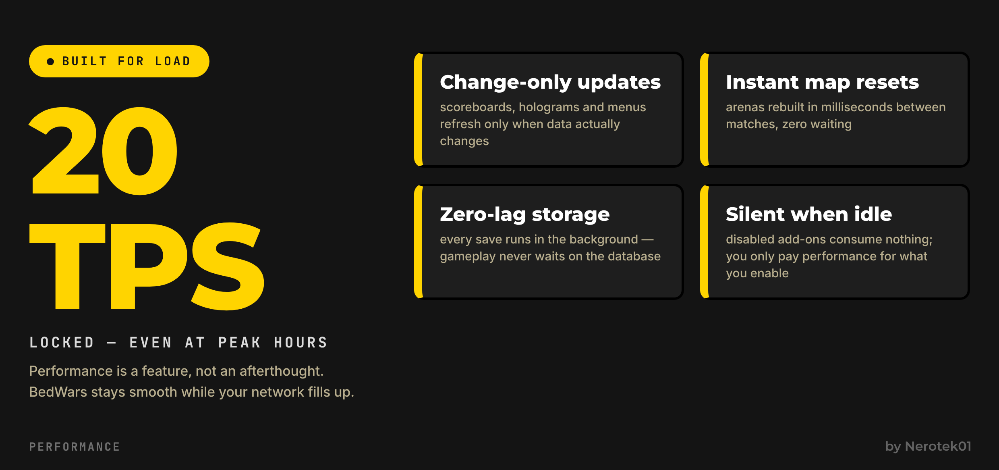
</p>

<p align="center">
  
</p>

This is the shape of a peak hour on a full network: **500+ players online**, every arena in use, and the tick rate untouched. The rest of this section explains how the plugin holds that line:

BedWars treats performance as a core feature, and every system is designed to protect the tick rate first:

- **Locked 20 TPS under load** – the plugin is built and tuned against real, full arenas — not empty test worlds.
- **Instant map resets** – arenas rebuild in milliseconds between matches, so the next game starts the moment players are ready.
- **Background database work** – every save, stat write and economy update happens off the game thread; gameplay never waits on storage.
- **Smart menus** – cosmetics and shop menus open instantly, even with hundreds of heads, skins and items configured.
- **Change-only updates** – scoreboards, holograms and health indicators refresh only when their data actually changes. Idle players cost nothing.
- **Silent add-ons** – a disabled add-on consumes nothing. You only pay performance for the features you actually enable — never money for them.
- **Safe under failure** – if the database slows down or drops a write under extreme load, the plugin protects the game first and logs the work for retry. Your TPS is never the sacrifice.

---

## Reliability & Fair Play

Smooth performance means nothing without correct behavior in the moments that matter. BedWars ships an entire layer dedicated to the real-world situations live networks actually hit — most of it invisible until the day it saves your server.

### Players Never Join a Broken Server
At startup, connections are politely held until **every arena has finished loading**, with a built-in failsafe so a single broken map can never lock your lobby forever. Players never fall into a half-loaded world — and never even notice the process.

### Global Maintenance Mode
Live networks need a master switch, and BedWars ships one as a first-class add-on. `/bw maintenance on` (admin-only, from the lobby) stops every running arena, sends all players and spectators back to the lobby, closes practice sessions with a full inventory restore, and clears the ranked and invis-practice queues — then keeps every join path (arena, spectator, rejoin, practice and queue) blocked until you run `/bw maintenance off`. While the mode is active, everyone online sees a clear title and chat broadcast naming the administrator who pulled the switch, and a confirmation broadcast the moment systems return. Staff holding `bedwars.admin` bypass the block so your team can keep working inside arenas, and games created by the ranked Discord bot adapter are exempt — bot queueing keeps running throughout maintenance. Every title, subtitle, broadcast and sound is configurable in `Addons/Maintenance/config.yml`, and an existing Meeting-mode config from an older install migrates automatically.

### Queues That Cannot Corrupt Each Other
A player waiting in the practice queue cannot join, spectate or interfere with ranked games, and vice versa. Every rejection comes with a clear chat message. Competitive integrity is enforced by the game itself, not by an honor system.

### Respawn Chat Protection
While a player is respawning, their messages carry a grey `[RESPAWNING]` tag, are visible only to their own team, and shout commands are blocked entirely. Dead players can no longer relay enemy positions across the map.

### A Spectator Teleporter That Behaves
The teleporter is a clean, paginated menu of all alive players, with a dedicated random-teleport button. Players who are mid-respawn are always excluded, so spectators can never teleport into a death animation.

### Safe Eliminations and Rejoins
Eliminated players convert to spectators through a protected transition, so a game-end health reset can never accidentally kill someone a second later. Players who disconnect mid-match can rejoin and recover their exact inventory and position.

### Admin Tools With Guard Rails
Force-join commands validate the target arena before moving players and always report a clear error instead of failing silently. Disabling and re-enabling an arena is reliable and repeatable — no restart required, no hidden state left behind.

### Maps Stay Pristine Between Games
Every arena is restored from its pristine copy between matches, so game-time damage never accumulates across games. Map files, metadata and world settings are preserved untouched — your builds look identical on match one and match one thousand.

### Clean Failure Modes
Running the plugin on an unsupported server version is detected immediately and reported with a clear message — never a cryptic console error in the middle of your startup. Config-driven commands are validated before they run, producing one clean warning instead of console spam.

---

## Ranked System (Full)

The native ranked mode transforms BedWars into a competitive, ELO-driven environment.

- **Central ranked service** – connects to a ranked backend for queues, ratings and match results.
- **Automated matchmaking** – players enter a ranked queue; games are created automatically when enough similarly-rated players are ready.
- **ELO rating** – every ranked match affects ratings, with seasons that can reset periodically.
- **Tournament NPCs** – seasonal lobby NPCs display rules and leaderboards and allow one-click queue entry.
- **Competitive restrictions** – ranked games can enforce a separate shop and upgrade tree to protect integrity; blacklisted entries are cancelled with a clear message, a dedicated deny sound and a smart throttle in **both the shop menu and the upgrades menu**, so spam-clicking a restricted entry never floods chat.
- **Player profiles** – wins, losses, kills, ELO history and season statistics per player.
- **Holographic leaderboard** – a real-time top-players display synchronized across the network.
- **Full placeholder support** – `%bedwars_ranked_elo%`, `%bedwars_ranked_wins%` and many more, everywhere placeholders work.

The ranked system requires a valid API token and access to the ranked service backend. Setup assistance is provided with every purchase — and ranked access is part of the license, not a separate subscription.

---

## Private Games

Private Games lets any party owner spin up a **custom, invite-only match** on its own cloned arena — no admin intervention required. The host controls every rule through a clean in-game menu (`/pg`), and the private game state is persisted so matches survive restarts.

- **Instant custom matches** – the host picks a map, sets the team size and starts; the arena is prepared automatically.
- **12+ gameplay modifiers** – game speed, one-hit-one-kill, custom max health, low gravity, bed insta-break, respawn time, event timers, upgrade limits, no-diamonds / no-emeralds modes, map break and separate generator tuning.
- **Full host controls** – invite players, kick troublemakers, force-start and dissolve the game at will.
- **Zero setup** – works out of the box on any existing arena; no extra maps to configure.
- **Lifecycle safety** – private-game commands cannot be used inside a normal arena, and map-selector joins are never blocked by the private-games restriction.

For your community this is a content machine: creators host custom games, players invite friends, and your server becomes the platform they run their events on — at no extra cost to you or them.

---

## Practice Arenas

A complete, standalone practice environment for players who want to train real BedWars skills without waiting in queues. Accessed via `/bw practice`, the practice add-on runs dedicated arenas with three disciplines:

- **Bridging** – configurable bridging styles, block types, angles and elevations, with per-run timing and stats.
- **MLG** – water bucket and clutch practice with adjustable difficulty, heights and positions.
- **Fireball & TNT jumping** – directional jump training with configurable placement, angles and item types.
- **Per-player statistics** – every session is tracked, stored and displayed in dedicated practice stat menus.
- **Practice spectators** – other players can watch sessions live.
- **Schematic engine** – practice maps load from schematics, reset instantly, and run alongside your main arenas.

### Invis Practice
A separate, ranked-style **1v1 invisibility practice queue** clones a real BedWars arena and matches two players against each other with invisibility mechanics — exactly like competitive ranked play. Queue countdown, match duration and cloning are fully configurable, and players join straight from the ranked menu. Strict queue isolation keeps practice and ranked queues from ever interfering with each other — and the practice worlds themselves are strictly **queue-only**: the configured source map and its queue clones can't be entered through `/bw join map`, `/bw join random`, group join, force-join, the map selector or spectate. The practice queue is the only way in.

---

## Replay System

The replay system delivers studio-grade match recordings without any compromise on server performance. It is deeply integrated into the game itself — recording starts when the match starts and stops when it ends, with zero commands and zero configuration.

- **Automatic recording** – every match is captured, named and tagged with arena, mode and date.
- **Complete event capture** – movement, blocks, hits, kills, bed breaks and pickups, all recorded.
- **Frame-accurate playback** – admins scrub, pause, rewind and fast-forward while the world rebuilds exactly as it appeared live.
- **Staff review toolkit** – X-ray mode for invisible players, hitbox visualization for reach checks, inventory overlays, adjustable speed and a smart follow-cam that locks onto the last attacker.
- **Smart retention** – recordings older than a configurable age are pruned automatically; important matches can be flagged to keep forever. Ranked matches are retained longer by default.
- **Portable evidence** – recordings are self-contained files that can be reviewed on any server running the replay engine, so cheat reports are decided on irrefutable evidence, not guesses.
- **Zero configuration, zero regret** – enabled by default, autodetects optimal storage, and begins recording silently. Every tunable is exposed in `replay.yml` for advanced setups.

---

## Cosmetics — 257 and Counting

The cosmetics suite ships with **257 individual cosmetics across 11 categories**, every one of them selectable, previewable and tied to the rarity system. This is the exact count of what your players get on day one — all included in the single purchase, with no cosmetic paywall or perk store:

| Category | Count | Examples |
|----------|------:|----------|
| Kill Messages | **45** | Samurai, Vampire, Tsunami, Phoenix |
| Death Cries | **39** | Dragon Roar, Wither Roar, Ghast Scream |
| Shopkeeper Skins | **36** | King of Beds, Warden, Iron Golem, Holiday Bartender |
| Final Kill Effects | **28** | Diamond Rain, Lightning Strike, Void Singularity, Rainbow Beam |
| Bed Destruction Effects | **26** | Meteor Shower, Tornado, Solar Flare, Soul Storm |
| Victory Dances | **19** | Dragon Rider, Raining Pigs, Twerk Apocalypse, Wither Rider |
| Sprays | **21** | Server Logo, Disco Pumpkin, Festival Lanterns |
| Projectile Trails | **17** | Ender, Lava, Magic, Firework |
| Wood Skins | **12** | Oak, Spruce, Acacia, Dark Oak — logs & planks |
| Glyphs | **8** | Sword, Storm, Burn, Bronze Shield |
| Island Toppers | **6** + random option | Cube, Pyramid, Dome, Beacon Tower |
| **Total** | **257** | across **11 categories** |

Beyond the numbers, the suite is a complete framework: every cosmetic has a rarity tier, a locked/unlocked state for progression, an in-menu preview, per-player persistence, and its own entry in the placeholder system — so you can build donor perks, battle-pass rewards or crate drops on top of it. Owners can add, remove or reprice any cosmetic in configuration, and the menu updates itself.

---

## 36+ Built-in Add-ons — All Included

Every add-on below ships inside the plugin, and **every one of them is already covered by the single €29 payment**. There is no add-on store, no per-module pricing, and no "pro version" — this table is the complete list of what you own the moment your loader activates. All add-ons are self-contained and toggled in `addons.yml`. When enabled they run at full capacity; when disabled they consume nothing.

| Add-on | Function |
|--------|----------|
| **Ranked** | Full competitive matchmaking, ELO, seasons, tournaments |
| **Quests** | Daily, weekly and seasonal quests with progress tracking and token/XP rewards |
| **Play Again** | One-click re-queue after match end |
| **Team Selector** | GUI team picker before game start |
| **Spectator Options** | Fly speed, night vision, auto-teleport controls |
| **Compass** | Enemy tracker compass with configuration menu |
| **Quick Buy** | Persistent per-player shop slots |
| **Arena Start Message** | Title/subtitle announcement at match start |
| **Reward Summary** | Detailed post-game rewards breakdown |
| **Voidless** | Void death protection – teleport to base instead |
| **BossBar** | Custom boss bar displaying game timer and team info |
| **Hotbar Manager** | Auto-arranges tools and blocks in the hotbar |
| **Stats Menu** | Interactive GUI for personal and global stats |
| **Map Selector** | Visual map voting system |
| **Leaderboard** | Holographic top-player display with daily, weekly and all-time timeframes |
| **Water Height Limit** | Prevents water placement above a configured Y level |
| **Adventure Mode** | Forces adventure mode in arenas |
| **Anti Drop** | Prevents item dropping (whitelist supported) |
| **Gen Split** | Splits generator loot among nearby sneaking teammates — evenly, with zero duplication |
| **Height Limit Notifier** | Warns players approaching the build ceiling |
| **Invisibility Footsteps** | Particles for invisible player movement |
| **Deposit** | Team resource deposit chest with hologram |
| **Level Bar** | XP bar repurposed to show player level |
| **Sponge** | Sponge water removal mechanics |
| **Token Economy** | Internal currency system – no Vault dependency |
| **Cosmetics** | The full 257-cosmetic suite across 11 categories |
| **Replay** | Automatic match recording with full playback tools |
| **Anti AFK** | Detects idle players and removes them, with configurable warnings |
| **Private Games** | Party-hosted custom matches with 12+ gameplay modifiers (`/pg`) |
| **Practice** | Bridging, MLG and fireball/TNT-jump arenas with per-player stats |
| **Invis Practice** | Ranked-style 1v1 invisibility practice queue on a cloned arena |
| **Cooldown Pearl** | Configurable ender pearl cooldown with message and sound feedback |
| **Leave Delay** | Return-to-Lobby item with a cancellable countdown |
| **Blocked Commands** | Global, per-arena and per-group command blocking inside arenas |
| **Maintenance Mode** | Global lockdown switch: stops all arenas, sends everyone to the lobby and blocks every join path until switched off (`/bw maintenance on/off`) |
| **Arena TP Protector** | Blocks unauthorized teleports to players inside an arena |
| **Map Command** | `/map` displays the current arena name |

---

## Commands & Permissions

Main command: `/bw` (alias `/bedwars`)

### Player Commands
| Command | Purpose | Permission |
|---------|---------|------------|
| `/bw join (map/group/random)` | Join a game | `bw.player` |
| `/bw join ranked` | Enter ranked queue | `bw.player` |
| `/bw leave` | Leave current game | `bw.player` |
| `/bw rejoin` | Rejoin last game | `bw.player` |
| `/bw shout (message)` | Global arena chat | `bw.player` |
| `/bw spectate (player)` | Spectate a player | `bw.spectate` |
| `/bw map` | Vote for next map | `bw.player` |
| `/bw stats (player)` | View statistics | `bw.player` |
| `/bw compass` | Tracker compass menu | `bw.player` |
| `/bw gui (group)` / `/bw map-gui` | Map selector GUI | `bw.player` |
| `/bw ranked` | Ranked menu (tournament arenas) | `bw.player` |
| `/bw quickbuy` | Customise quick-buy slots | `bw.player` |
| `/bw tokens (player)` | Token balance | `bw.player` |
| `/bw hotbar menu` | Hotbar manager GUI | `bw.player` |
| `/bw quests` | Quest menu — progress tracking and reward claims | `bw.player` |
| `/bw level` | View level progression | `bw.player` |
| `/bw spawn` | Return to the main lobby | `bw.player` |
| `/bw teleporter` | Spectator teleporter GUI | `bw.spectate` |
| `/bw cosmetics` | Open the cosmetics menu | `bw.player` |
| `/bw upgradesmenu` | Preview team upgrades menu | `bw.player` |
| `/bw practice` (`/bwp`) | Practice arenas — join, leave, stats and mode menu | `bw.player` |
| `/bw invispractice` | Join the invis practice queue | `bw.player` |
| `/bw pg` | Private games menu — create and manage custom matches | `bw.player` |
| `/party` (`/p`, `/pc`) | Full party system — invite, accept, kick, warp, polls | `bw.player` |

### Admin Commands
| Command | Purpose | Permission |
|---------|---------|------------|
| `/bw setup` | Interactive arena creation | `bw.admin` |
| `/bw setlobby` | Set lobby spawn | `bw.admin` |
| `/bw setuparena (name)` | Create new arena | `bw.admin` |
| `/bw enable/disablearena (name)` | Enable/disable arena reliably | `bw.admin` |
| `/bw clonearena (src) (dst)` | Clone arena configuration | `bw.admin` |
| `/bw arenagroup (arena) (group)` | Set arena group | `bw.admin` |
| `/bw build` | Toggle build mode | `bw.admin` |
| `/bw createteam (name) (color)` | Create a team | `bw.admin` |
| `/bw setspawn (team)` | Team spawn point | `bw.admin` |
| `/bw removeteam (name)` | Remove a team | `bw.admin` |
| `/bw setbed (team)` | Team bed location | `bw.admin` |
| `/bw setshop (team)` | Team shop location | `bw.admin` |
| `/bw setupgrade (team)` | Team upgrades NPC location | `bw.admin` |
| `/bw setkilldrops` | Kill drops location | `bw.admin` |
| `/bw setmaxinteam (int)` | Max players per team | `bw.admin` |
| `/bw setmaxbuildheight (int)` | Arena build height limit | `bw.admin` |
| `/bw setwaitingspawn` | Waiting lobby spawn | `bw.admin` |
| `/bw setspectspawn` | Spectator spawn | `bw.admin` |
| `/bw settype (type)` | Arena game type | `bw.admin` |
| `/bw addgenerator (type) (tier)` | Add resource generator | `bw.admin` |
| `/bw removegenerator` | Remove nearest generator | `bw.admin` |
| `/bw autocreateteams (mode)` | Auto-create teams | `bw.admin` |
| `/bw save` | Save arena | `bw.admin` |
| `/bw start` | Force start arena | `bw.admin` |
| `/bw reload` | Reload configuration | `bw.admin` |
| `/bw npc` | Manage lobby and shop NPCs | `bw.admin` |
| `/bw leaderboard` | Manage holographic leaderboards | `bw.admin` |
| `/bw maintenance (on/off)` | Toggle global maintenance mode — stop all arenas and empty them, or resume normal operation (lobby only) | `bw.admin` |
| `/bw ranked tournament start (arena)` | Start tournament | `bedwars.ranked.tournament.start` |
| `/bw ranked tournament cancel (arena)` | Cancel tournament | `bedwars.ranked.tournament.start` |

---

## Full Configuration — With Ready Defaults

**Everything in BedWars is 100% configurable.** Every item, price, message, menu title, cooldown, sound, reward and gameplay rule can be changed from the configuration files — the plugin you receive is a complete engine, and you decide every visible detail of it. Nothing is hard-coded, nothing is locked away.

Every value is editable in the `plugins/BedWars/` directory. Nothing is locked away. **More importantly: you do not have to edit any of it to go live.** All of the important sections ship with complete, working default configurations — the shop (categories, prices, quick-buy layout), generators, levels, tokens, quests and messages all come pre-configured and match what you play on the demo server. Install, start, and the server is playable; customize at your own pace from there.

| File | Purpose | Ships with default? |
|------|---------|---------------------|
| `config.yml` | Server type, database, lobby, game rules, performance tuning | Yes — ready defaults |
| `generators.yml` | Generator timing and resources | Yes — ready defaults |
| `shop.yml` | Shop categories, prices, quick-buy defaults | Yes — full default shop |
| `addons.yml` | Enable/disable each add-on | Yes — sensible presets |
| `messages_en.yml` | All plugin messages (multi-language ready) | Yes — complete set |
| `levels.yml` | XP required per level | Yes — ready defaults |
| `money.yml` | Token earnings per action | Yes — ready defaults |
| `ranked.yml` | Ranked service credentials | Yes — assisted at setup |
| `Configs/blocked-commands.yml` | Global, per-arena and per-group blocked commands | Yes — safe defaults |
| `Addons/Practice/config.yml` | Practice arena settings and stats | Yes — ready defaults |
| `Addons/InvisPractice/config.yml` | Invis practice queue configuration | Yes — ready defaults |
| `Addons/LeaveDelay/config.yml` | Leave delay countdown settings | Yes — ready defaults |
| `Addons/Cosmetics/` | Cosmetics menus, categories and items | Yes — all 257 items |
| `Arenas/*.yml` | One configuration file per arena | Yes — created by `/bw setup` |

Every background batch size — from scoreboard refresh to hologram spawning — is exposed as a simple config value, so you can fine-tune the plugin for any hardware. The defaults are production-tuned already; most owners never touch them.

---

## Automatic Database Backup

BedWars includes an automatic database backup system that periodically exports your entire database to a secure location. The interval and output path are fully configurable, backups run in the background with zero impact on gameplay, and they cover both MongoDB and SQLite. In the event of hardware failure or accidental data corruption, a complete restore is one file away.

---

## Database & Storage

Data persistence is a first-class component of BedWars, not an afterthought.

- **Dual-engine architecture** – MongoDB and SQLite behind one unified interface; switching between them is a single config change.
- **Tuned out of the box** – connection pooling, write-ahead logging and busy-timeouts are pre-configured for maximum performance on both engines.
- **Batch economy saving** – token changes are accumulated and flushed in bulk, reducing write pressure dramatically on busy networks.
- **Asynchronous MongoDB** – even complex queries never touch the game thread.
- **Cross-server sync (optional)** – Redis shares player levels and preferences across a BungeeCord network with automatic cache invalidation.
- **Safe on failure** – failed writes are rolled back cleanly, and shutdowns close every connection gracefully. Your data survives crashes, restarts and migrations.

---

## PlaceholderAPI — Complete Reference

BedWars registers **three complete PlaceholderAPI expansions** — `bedwars`, `cosmetics` and `ranked` — giving you more than 80 placeholders for scoreboards, leaderboards, lobbies, donor displays and third-party plugins. PlaceholderAPI is the plugin's only required dependency.

### Expansion 1 — `%bedwars_*%` (main)

**Player statistics**

| Placeholder | Description |
|-------------|-------------|
| `%bedwars_stats_kills%` | Kill count |
| `%bedwars_stats_total_kills%` | All-time kills including final kills |
| `%bedwars_stats_finalkills%` | Final kill count |
| `%bedwars_stats_deaths%` | Death count |
| `%bedwars_stats_finaldeaths%` | Final death count |
| `%bedwars_stats_wins%` | Win count |
| `%bedwars_stats_losses%` | Loss count |
| `%bedwars_stats_gamesplayed%` | Games played |
| `%bedwars_stats_bedsdestroyed%` | Beds broken |
| `%bedwars_stats_bedslost%` | Beds lost |
| `%bedwars_stats_winstreak%` | Current win streak |
| `%bedwars_stats_best_winstreak%` | Best ever win streak |
| `%bedwars_stats_kdr%` | Kill/death ratio |
| `%bedwars_stats_fkdr%` | Final kill/death ratio |
| `%bedwars_stats_wlr%` | Win/loss ratio |
| `%bedwars_stats_bblr%` | Beds broken/lost ratio |
| `%bedwars_stats_iron%` | Lifetime iron collected |
| `%bedwars_stats_gold%` | Lifetime gold collected |
| `%bedwars_stats_diamond%` | Lifetime diamonds collected |
| `%bedwars_stats_emerald%` | Lifetime emeralds collected |
| `%bedwars_stats_firstplay%` | First play date |
| `%bedwars_stats_lastplay%` | Last play date |

**Per-group statistics** — the full stat list above is also available per game group. Replace `<group>` with the group key (e.g. `solos`, `doubles`, `ranked`):

| Placeholder | Description |
|-------------|-------------|
| `%bedwars_groupstats_<group>_gamesPlayed%` | Games played with the group |
| `%bedwars_groupstats_<group>_wins%` | Wins with the group |
| `%bedwars_groupstats_<group>_losses%` | Losses with the group |
| `%bedwars_groupstats_<group>_kills%` | Kills |
| `%bedwars_groupstats_<group>_deaths%` | Deaths |
| `%bedwars_groupstats_<group>_finalKills%` | Final kills |
| `%bedwars_groupstats_<group>_finalDeaths%` | Final deaths |
| `%bedwars_groupstats_<group>_bedsDestroyed%` | Beds broken |
| `%bedwars_groupstats_<group>_bedsLost%` | Beds lost |
| `%bedwars_groupstats_<group>_winstreak%` | Current win streak |
| `%bedwars_groupstats_<group>_wlr%` | Win/loss ratio |
| `%bedwars_groupstats_<group>_fkdr%` | Final kill/death ratio |
| `%bedwars_groupstats_<group>_iron%` | Iron collected in the group |
| `%bedwars_groupstats_<group>_gold%` | Gold collected in the group |
| `%bedwars_groupstats_<group>_diamond%` | Diamonds collected in the group |
| `%bedwars_groupstats_<group>_emerald%` | Emeralds collected in the group |

**Level, XP & economy**

| Placeholder | Description |
|-------------|-------------|
| `%bedwars_player_level%` | Display level (formatted) |
| `%bedwars_player_level_raw%` | Raw level number |
| `%bedwars_player_progress%` | XP progress bar |
| `%bedwars_player_xp%` / `%bedwars_player_xp_formatted%` | Current XP |
| `%bedwars_player_req_xp%` / `%bedwars_player_req_xp_formatted%` | XP required for next level |
| `%bedwars_tokens%` / `%bedwars_token_balance%` | Token balance |
| `%bedwars_tokens_formatted%` / `%bedwars_token_balance_formatted%` | Token balance, formatted (1.2k, 3.4M …) |

**Live game state**

| Placeholder | Description |
|-------------|-------------|
| `%bedwars_team_color%` / `%bedwars_player_team_color%` | Team color code |
| `%bedwars_team_letter%` / `%bedwars_player_team_letter%` | Team letter (e.g. `R `, `B `) |
| `%bedwars_player_team%` | Team display name |
| `%bedwars_player_status%` | `WAITING` / `PLAYING` / `SPECTATING` / `RESTARTING` |
| `%bedwars_current_arena_group%` | Group of the current arena |
| `%bedwars_elapsed_time%` | Elapsed match time |
| `%bedwars_arena_id%` | Current arena ID |
| `%bedwars_replay_viewer%` | `Viewer` tag while watching a replay |

**Arena & lobby displays**

| Placeholder | Description |
|-------------|-------------|
| `%bedwars_arena_status_<arena>%` | Live status of a specific arena |
| `%bedwars_arena_count_<a1+a2+...>%` | Total players across listed arenas |
| `%bedwars_arena_group_<arena>%` | Group of a specific arena |
| `%bedwars_group_count_<group>%` | Total players in a group |
| `%bedwars_lb_<stat>_<period>_<pos>%` | Leaderboard value (stats: `wins`, `kills`, `finalkills`, `bedsdestroyed`, `winstreak`, `level`) |
| `%bedwars_lb_<stat>_<period>_<pos>_name%` | Leaderboard player name |

**Ranked (via the main expansion)**

| Placeholder | Description |
|-------------|-------------|
| `%bedwars_ranked_<stat>%` | Any stat from the player's ranked profile |
| `%bedwars_rbw_leaderboard_<category>_<pos>_name%` | Ranked leaderboard name |
| `%bedwars_rbw_leaderboard_<category>_<pos>_value%` | Ranked leaderboard value |
| `%bedwars_rbw_stats_<stat>%` | Ranked profile statistic |
| `%bedwars_rbw_rank_color%` | Player's ELO rank color |

### Expansion 2 — `%cosmetics_*%`

Per-category progress — `<category>` is one of: `victory_dance`, `final_kill`, `death_cry`, `shopkeeper_skin`, `kill_message`, `glyph`, `bed_destroy`, `wood_skin`, `projectile_trail`, `spray`:

| Placeholder | Description |
|-------------|-------------|
| `%cosmetics_<category>_unlocked%` | How many cosmetics of the category the player owns |
| `%cosmetics_<category>_total%` | Total cosmetics in the category |
| `%cosmetics_<category>_percentage%` | Collection completion in percent |
| `%cosmetics_<category>_selected%` | The player's currently selected cosmetic |

**Short-form shortcuts** — one line per category, every name verified against the plugin's placeholder engine (note the three authentic irregulars: `selected_glyph`, `selected_skin`, `selected_islandtopper`):

| Category | Owned | Total | Selected |
|----------|-------|-------|----------|
| Victory Dances | `%cosmetics_owned_vd%` | `%cosmetics_total_vd%` | `%cosmetics_selected_vd%` |
| Final Kill Effects | `%cosmetics_owned_finalkill%` | `%cosmetics_total_finalkill%` | `%cosmetics_selected_finalkill%` |
| Bed Break Effects | `%cosmetics_owned_bbe%` | `%cosmetics_total_bbe%` | `%cosmetics_selected_bbe%` |
| Death Cries | `%cosmetics_owned_dc%` | `%cosmetics_total_dc%` | `%cosmetics_selected_dc%` |
| Kill Messages | `%cosmetics_owned_km%` | `%cosmetics_total_km%` | `%cosmetics_selected_km%` |
| Wood Skins | `%cosmetics_owned_ws%` | `%cosmetics_total_ws%` | `%cosmetics_selected_ws%` |
| Projectile Trails | `%cosmetics_owned_pt%` | `%cosmetics_total_pt%` | `%cosmetics_selected_pt%` |
| Glyphs | `%cosmetics_owned_gly%` | `%cosmetics_total_gly%` | `%cosmetics_selected_glyph%` |
| Sprays | `%cosmetics_owned_spray%` | `%cosmetics_total_spray%` | `%cosmetics_selected_spray%` |
| Shopkeeper Skins | `%cosmetics_owned_shopkeeper%` | `%cosmetics_total_shopkeeper%` | `%cosmetics_selected_skin%` |
| Island Toppers | `%cosmetics_owned_island%` | `%cosmetics_total_island%` | `%cosmetics_selected_islandtopper%` |

These power collection displays, donor menus and "collection complete" achievements in any PlaceholderAPI-compatible plugin.

### Expansion 3 — `%ranked_*%`

| Placeholder | Description |
|-------------|-------------|
| `%ranked_leaderboard_<category>_<rank>_name%` | Ranked leaderboard entry name |
| `%ranked_leaderboard_<category>_<rank>_value%` | Ranked leaderboard entry value |
| `%ranked_stats_<stat>%` | Ranked profile statistic |
| `%ranked_queue_count%` | Players currently in the ranked queue |
| `%ranked_rank_color%` | Player's ELO rank color |

All placeholders work with any PlaceholderAPI-compatible plugin — scoreboards, chat formatters, tab plugins, holograms and menus alike.

---

## Optional Integrations

PlaceholderAPI is the **only required dependency**. Beyond that, BedWars detects and enhances itself automatically when these plugins are present — and runs perfectly without them:

- **SlimeWorldManager** – unlocks in-memory, millisecond map resets. The replay add-on uses it for replay worlds and gracefully auto-disables itself when it is absent, so the rest of the plugin keeps running untouched.
- **Citizens** – enables join NPCs in your lobby and shopkeeper skin cosmetics.
- **Vault** – optional economy and chat hooks for networks that prefer an external economy. The built-in token economy remains fully functional without it.
- **Parties (AlessioDP)** – drop-in external party plugin support; the internal `/party` system needs nothing at all.

---

## BungeeCord, Proxy Plugin & Auto-Scale

BedWars is designed for multi-server networks from the ground up. The purchase includes **BedWarsProxy**, a dedicated companion plugin that runs on your BungeeCord or Velocity instance — included at no extra cost, like every other part of the plugin.

**What BedWarsProxy handles:**
- Lobby queue management and player distribution across game servers.
- Fast, reliable communication between the lobby and all game servers — surviving reloads without operator intervention.
- Automatic server scaling: when demand rises, the proxy signals your infrastructure to start new game servers; when demand drops, idle servers shut down.
- Matchmaking for ranked and casual games, keeping parties together and placing players in appropriate arenas.

All synchronization is built in. You do not need external scripts, orchestrators, or extra plugins to run a fully automated, elastic BedWars network.

---

## Developer API

BedWars exposes a full Java API for teams who want to build on top of it: join events, bed-break events, match lifecycle hooks, arena lookups, economy access and custom sub-commands — all documented and version-stable. If your network needs a custom integration (crates, battle passes, websites, Discord bots), the API gives you clean, supported entry points instead of fragile workarounds. API access and guidance are included with every purchase.

---

## The Official Repository

BedWars is an actively developed product with a real home on GitHub — hundreds of commits, versioned releases and a full development history behind every download. The screenshot below is the **actual, live GitHub page of the source repository** (dark theme), so you can see with your own eyes what stands behind this plugin: a serious, maintained codebase — not a weekend script.

<p align="center">
  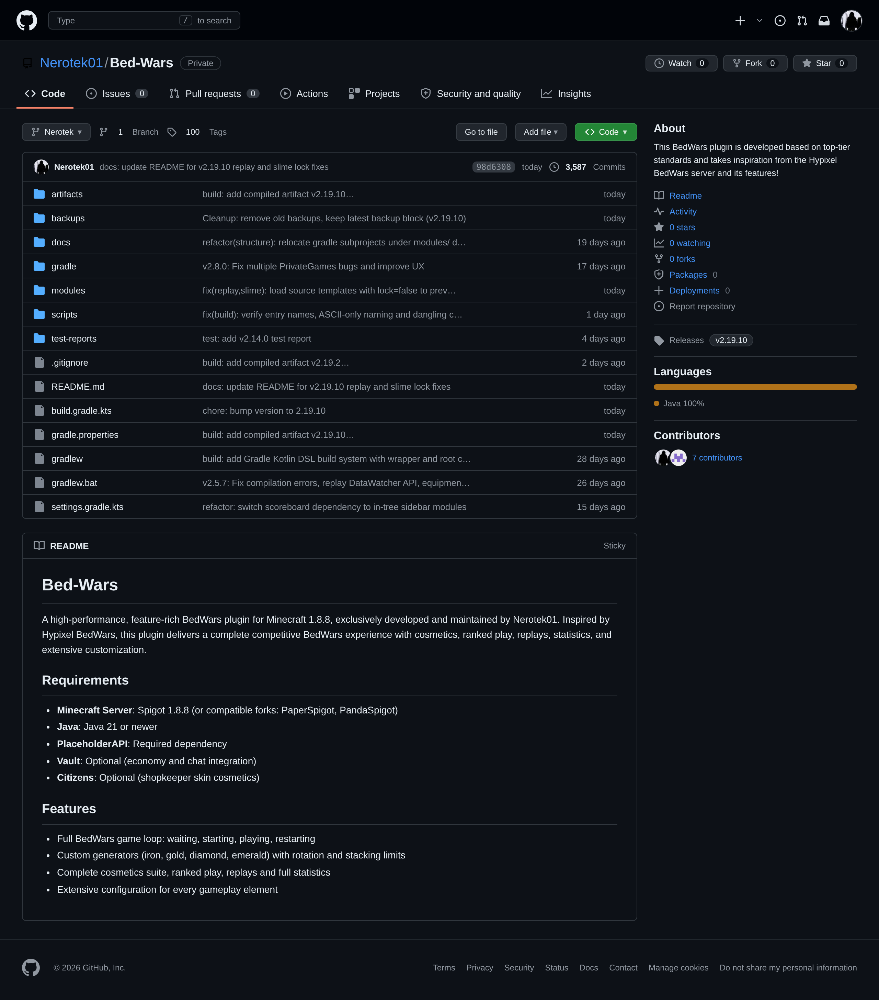
</p>

And because the repository is real, the code is real too. The image below is a **genuine, unedited excerpt of the main `BedWars` class** — same file, same line numbers, exactly as it is written in the repository. This is the sample that proves the coding standard:

<p align="center">
  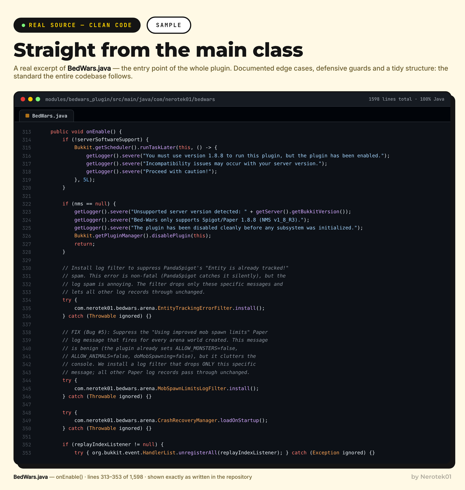
</p>

Documented edge cases, defensive guards, readable structure and honest comments — this is the standard the entire codebase follows, from the entry point down to the smallest add-on. It is exactly why BedWars can ship frequent updates without breaking servers.

As you can see, development moves fast — new builds, tests and release notes land continuously, and every released version is tagged. Buyers receive the plugin as a **personal loader** (the ready-to-run product build); direct source access stays with the developer, which is exactly what protects your investment: one accountable author, one codebase, no leaks, no resold copies floating around.

<p align="center">
  <a href="https://github.com/Nerotek01/BedWars"><strong>Public releases & updates: github.com/Nerotek01/BedWars</strong></a>
</p>

---

## Frequently Asked Questions

### Pre-purchase Questions

**Q: Is this a single plugin or do I need multiple downloads?**
A: BedWars ships as a single plugin containing 36+ built-in add-ons. You also receive the companion BedWarsProxy plugin for your BungeeCord/Velocity proxy — all included in the same purchase.

**Q: Do I have to pay extra for any add-on, module or feature?**
A: **No — never.** The one payment covers 100% of the plugin: the game core, all 36+ add-ons, the full 257-cosmetic suite, the replay system, ranked access and the proxy plugin. There is no add-on store, no premium tier, no unlock fees, and no feature that will ever ask you for more money.

**Q: Is this a fork or a custom edit of another BedWars plugin?**
A: No. BedWars is an **original plugin written completely from scratch** by its developer — not a fork of any open-source project, not a modified version of another premium plugin, and not a rebrand. Every system was designed and implemented for this product specifically.

**Q: Do I need to configure everything myself before opening the server?**
A: No. All of the important parts ship with **complete, working default configurations** — the full shop, generators, levels, tokens, quests and messages are pre-configured out of the box and match the demo server exactly. You can open to players immediately and customize at your own pace later.

**Q: Does it support versions newer than 1.8.8?**
A: BedWars is currently built exclusively for 1.8.8. This single-version focus is what allows its deep optimizations and rock-solid stability. If future versions are supported, they will be provided as separate, equally optimized branches.

**Q: Do I need Vault or an economy plugin?**
A: No. BedWars uses a fully internal token economy. The only external dependency is PlaceholderAPI. Vault, Citizens, Parties and SlimeWorldManager are all optional and simply unlock extra conveniences when present.

**Q: How does the license work?**
A: One payment of **€29.00** grants a permanent license that covers every server you own. There are no recurring fees, no per-server charges, and no hidden costs.

**Q: Can I test the plugin before buying?**
A: Yes. Connect to `mc.hypeland.org` and experience the full plugin on a live network — no registration, no whitelist.

### Delivery & Loader Questions

**Q: How do I buy the plugin?**
A: Everything happens directly in DMs. Open a DM with the developer (Discord `Nerotek01` or Bale `Nerotek`), discuss your setup, complete the payment, and your **personal loader** is issued to you. See [Support & Purchasing](#support--purchasing) for the full walkthrough.

**Q: What exactly is the "personal loader"?**
A: The loader is a small launcher build prepared **specifically for you** after your payment is confirmed. It is the key that activates the full BedWars suite on your servers. Each loader is issued to one buyer — it is your license, in executable form.

**Q: Which operating systems does the loader support?**
A: **Linux and Windows.** The loader ships for both — Linux servers, which is what virtually all production Minecraft servers run, and Windows machines. Whether your network runs on a Linux VPS, a standard Minecraft host or a Windows box, you are fully covered. If you are unsure about your setup, just ask in the DM and it will be checked with you.

**Q: How is the loader protected?**
A: The loader is strictly protected and bound to your purchase. It enforces real restrictions — including an **IP limit** — so it only works where it was issued to work. Bypassing or tampering with it is not possible in any practical way, and attempts are detected.

**Q: What happens if someone tries to bypass or crack the loader?**
A: The license is **permanently revoked — there is no way back**, for the original buyer too. Repeated bypass attempts from the same buyer can lead to a full **blacklist**: no future purchases, no replacements, no exceptions. This policy is what keeps the price at a flat €29 for everyone else.

**Q: When do I receive my loader?**
A: Usually within hours of payment confirmation, delivered directly inside your DM conversation. You also receive setup help until the plugin is running on your network.

**Q: Can I share or resell my loader?**
A: No. Loaders are bound to the buyer. A shared or resold loader is invalidated and the associated license is permanently revoked — including for the original buyer.

**Q: What if I lose my loader or rebuild my infrastructure?**
A: Just message the developer from the same DM. Your purchase is on record, and a replacement loader for the same license is re-issued — for example when your server IPs change.

**Q: Where do I get the full technical details about the loader?**
A: Complete explanations — setup, requirements, security behavior and the protection policy — are given **personally at purchase time**, directly in your DM conversation. Everything relevant to your infrastructure is covered before you pay.

### Technical Questions

**Q: What Java version does my server need?**
A: A modern Java runtime (Java 21+). Setup assistance for your start scripts is included with support.

**Q: Does BedWars work on a shared server with other minigames?**
A: Yes. Multi-Arena mode lets it coexist with other plugins on the same server instance.

**Q: Can I switch between SQLite and MongoDB later?**
A: Absolutely. One config change switches the engine, and all data is migrated automatically on the next restart.

**Q: How does automatic scaling work?**
A: The included BedWarsProxy monitors player demand and signals your infrastructure to start or stop game servers. Parties stay together and ranked queues fill correctly across the whole network.

**Q: What happens if my database gets corrupted?**
A: Automatic background backups run on a configurable schedule. A complete restore is one file away — and support helps you do it.

### Support

**Q: How do I get help if something breaks?**
A: You have 24/7 direct access to the developer via Discord (`Nerotek01`) or Bale (`Nerotek`). No tickets, no forums, no canned replies.

**Q: Are updates free?**
A: All updates for the current major version are included with your permanent license — delivered through your loader, again with no extra payment.

---

## Support & Purchasing

<p align="center">
  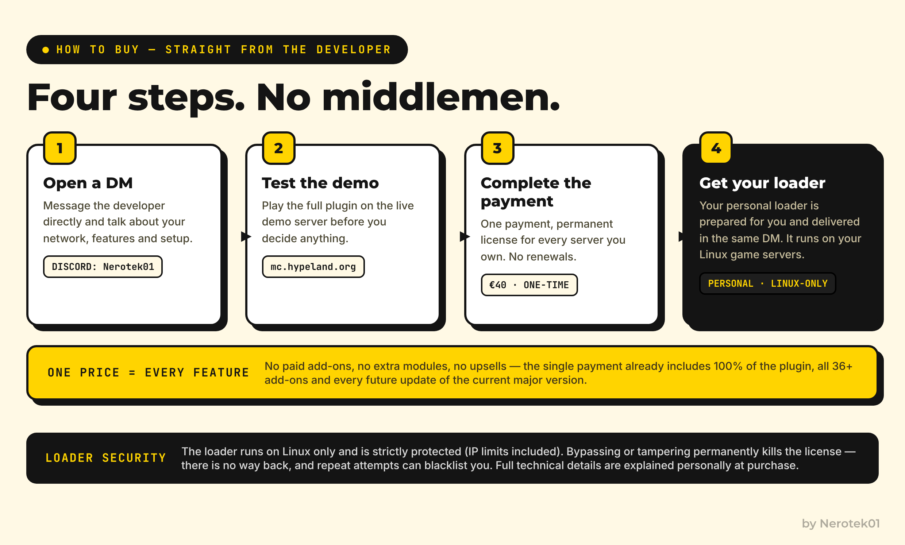
</p>

**BedWars** is a premium plugin sold exclusively by the developer — no marketplaces, no resellers, no license-key vending machines. The entire purchase is a short, personal process that happens in your DMs.

### The Purchase Process — Step by Step

**Step 1 — Open a DM and contact the developer.**
Message `Nerotek01` on Discord or `Nerotek` on Bale (for Iranian users). You are talking directly to the person who built the plugin. Ask about features, performance, your network architecture, licensing or anything else — you get straight answers, not sales scripts.

**Step 2 — Test the live demo and confirm your setup.**
Connect to `mc.hypeland.org` and experience ranked matchmaking, the full shop, generators, replays, cosmetics and every add-on exactly as your players would. Once you are satisfied, you and the developer confirm your license details together.

**Step 3 — Complete the payment.**
One payment of **€29.00**. Permanent license. Covers every server you own — from a single lobby to a 50-server network — **and every add-on the plugin contains**. No renewals, no per-server fees, no add-on charges, no hidden costs, and all updates for the current major version included free.

**Step 4 — Receive your personal loader.**
After your payment is confirmed, a **unique loader is prepared and issued for you personally**. The loader is the key to the plugin: run it once, and the complete BedWars suite — the game plugin, BedWarsProxy, all 36+ add-ons and ranked backend access — is activated for your network. Delivery happens directly in your DM, usually within hours.

### The Personal Loader — Requirements & Security

The loader is what makes a flat €29 price possible for everyone, so its rules are firm and applied the same way to every buyer:

- **Linux & Windows.** The loader runs on both Linux game servers — the standard for production Minecraft hosting — and Windows machines. Whatever operating system your servers run, you are covered; if you are unsure, ask in the DM and your setup will be checked with you.
- **Strictly protected.** Every loader is a unique, personal build with hard security restrictions — including an **IP limit** that binds it to the infrastructure it was issued for.
- **Bypassing = permanent ban.** Any attempt to bypass, tamper with or reverse the loader's protection **permanently revokes the license. There is no way back** — no refund, no re-issue, no exceptions, even for the original buyer.
- **Repeat attempts = blacklist.** Repeated bypass attempts can blacklist you completely: no future purchases, no replacements, no support.
- **Full details at purchase.** Complete technical explanations — requirements, setup, and how the protection behaves in practice — are provided personally in your DMs when you buy, so there are zero surprises.

### Contacts

- **Discord:** `Nerotek01`
- **Bale (Iranian users):** `Nerotek`
- **Demo server:** `mc.hypeland.org`
- **Price:** **€29.00** — one-time payment, permanent license, all add-ons included.

### What You Receive
- Your **personal loader** — a unique build issued only to you (Linux or Windows).
- The complete BedWars game plugin.
- The BedWarsProxy companion plugin.
- **All 36+ add-ons — already paid for, nothing locked, nothing extra to buy.**
- The full 257-cosmetic suite, replay system and ranked access.
- **Ready default configurations for every important section** — the shop, generators, levels, quests and messages work out of the box.
- Free updates for the current major version.
- **24/7 priority support** via Discord or Bale.

### Loader Policy
Your loader is bound to you — keep it private. Each loader is issued to a single buyer and is the only way to run the plugin. Shared or resold loaders are invalidated and the license permanently revoked. Bypassing or tampering with the loader's protection is permanent: the license dies, it cannot be recovered, and repeated attempts blacklist the buyer entirely. If you lose your loader or rebuild your infrastructure, the developer re-issues it from your purchase record — your license itself never expires.

### Support Promise
When an issue arises on your live network, you do not file tickets and hope for a reply. You speak directly with the developer. Your uptime is our reputation.

---

## Roadmap

- **Continuous performance work** – ongoing profiling and tuning as networks grow.
- **Expanded API** – additional events, hooks and documentation for custom integrations.
- **More cosmetics** – new items are added to the 257-cosmetic suite in every major update.

---

## Beyond the Documentation

This README is deliberately thorough — and it still covers only part of the surface. BedWars contains **many more sections, systems and small touches than any document can fully describe**: the parts you feel mid-game rather than read about, the admin conveniences that only reveal themselves while you configure your network, and dozens of details that were designed silently into the experience instead of being printed in a feature list. Text and screenshots can prove the plugin is real and complete — but they cannot let you *feel* it. **The only complete way to examine everything is to play it, and to own it**: connect to the demo server and push every menu until you have found the corners no README mentions — and when you want all of it on your own network, that is exactly what the single €29 purchase below hands you. The whole plugin. Nothing held back, nothing undocumented on purpose.

---

<p align="center">
  <a href="https://mc.hypeland.org"><strong>Connect to the demo: mc.hypeland.org</strong></a><br><br>
  <strong>Discord · Nerotek01</strong> &nbsp;|&nbsp; <strong>Bale · Nerotek</strong> &nbsp;|&nbsp; <strong>€29 · Permanent · Everything Included</strong><br>
  <sub>Product of Nerotek01</sub>
</p>
